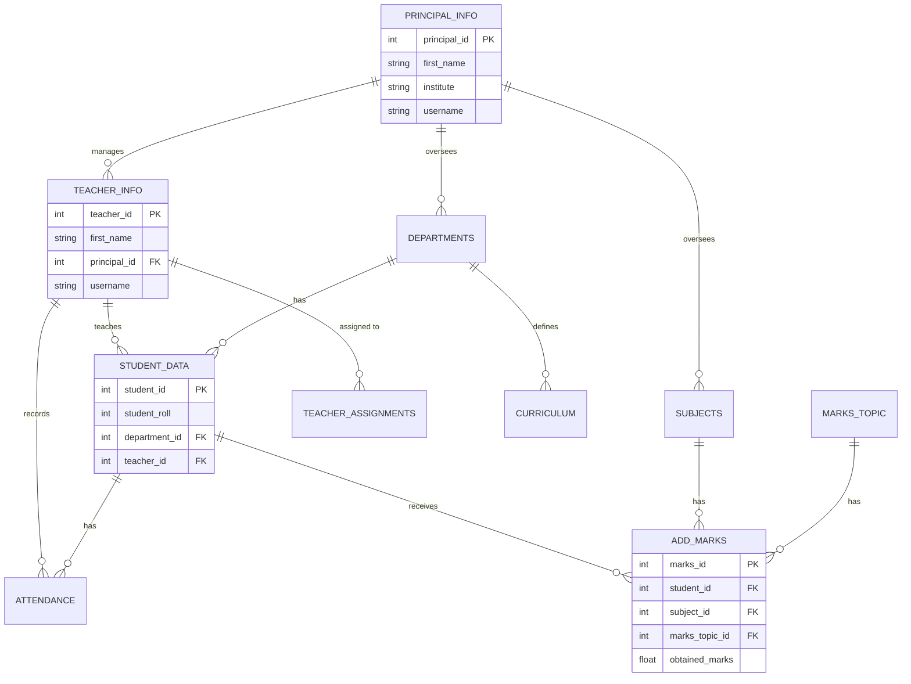

# Database Design

The Result Management System uses **SQLAlchemy**, a powerful Object-Relational Mapper (ORM) for Python, to manage the database schema. An ORM allows developers to interact with the database using Python classes and objects instead of writing raw SQL queries.

## Entity Relationship (ER) Overview

Understanding the relational model is crucial. Here is a high-level ER diagram of the current database structure:

## Core Models (`app/models/`)

The database is divided into several files based on domains:

### 1. `admin.py` & `principal.py`
These handle the upper-level management users.
- **`PrincipalDataInfo`**: Represents the head of an institute.
- **`TeacherAddInfo`**: Represents a teacher, linked to a specific Principal.

### 2. `assign.py`
This module manages the core academic structure.
- **`Department`**: Departments like Science, Arts, etc.
- **`Subjects`**: Individual courses.
- **`Curriculum`**: Maps Departments, Semesters, and Subjects together.
- **`TeacherAssignment`**: Maps a teacher to a specific subject, department, and semester.

### 3. `teacher.py`
This module handles student interactions and grading.
- **`AddStudentInfo`**: Contains student demographic and academic enrollment data.
- **`Attendance`**: Records daily attendance. Includes a unique constraint to ensure a student cannot have two attendance records for the same day.
- **`MarksTopic`**: Defines grading categories (e.g., Midterm, Final, Assignment) and their max marks.
- **`AddMarks`**: The actual grades achieved by students in specific topics.

## Why this structure matters for AI

When we move towards building a RAG (Retrieval-Augmented Generation) system, an LLM will not automatically understand these SQL tables.

> [!IMPORTANT]
> **The Data Challenge for AI:**
> If you want an AI agent to answer the question: *"Why is student 102 failing?"*, the agent would need to write a complex SQL join across `STUDENT_DATA`, `ADD_MARKS`, `SUBJECTS`, and `ATTENDANCE`.
>
> **The Solution (Phase 3 & 4):**
> We will extract this relational data, format it as descriptive text (e.g., *"Student John Doe, Roll 102, has 40% attendance and scored 35/100 in Mathematics"*), convert that text into vector embeddings, and store them in a Vector Database. The AI can then search and reason over these vectors natively.
